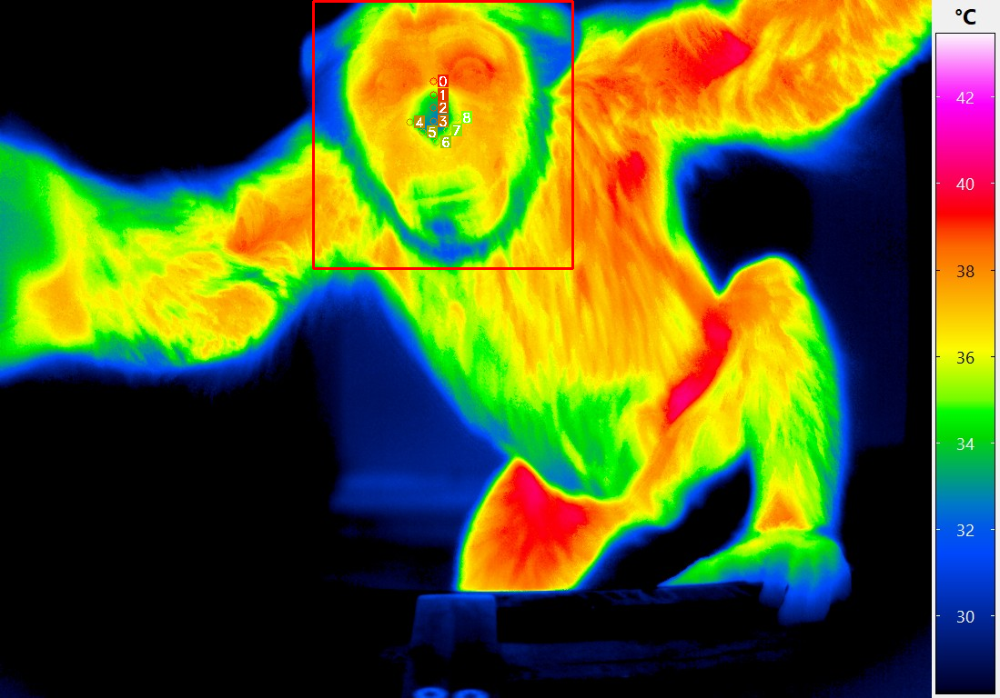

# ApeTI
ApeTI: A Thermal Image Dataset for Face and Nose Segmentation with Apes

This repository is a work in progress. The paper linked to this repository is currently under revision.

ApeTI dataset was built with the aim of retrieving physiological signals such as heart rate, breath rate, and cognitive load from thermal images of great apes. We want to develop computer vision tools that psychologists and animal behaviour researchers can use to retrieve physiological signals non-invasively.
Our goal is to increase the use of thermal imaging modality in the community and avoid using more invasive recording methods to answer research questions. The first step to retrieving physiological signals from thermal imaging is their spatial segmentation to then analyse the time series of the regions of interest.
For this purpose, we present a Thermal Imaging dataset based on recordings of chimpanzees with their face and nose annotated using a bounding box and nine landmarks.
The face and landmarks' locations can then be used to extract physiological signals. The dataset was acquired using a thermal camera at the Leipzig Zoo. 
Juice was provided in the vicinity of the camera to encourage the chimpanzee to approach and have a good view of the face. Several computer vision methods are presented and evaluated on this dataset.
We reach mAPs of 0.74 for face detection and 0.98 for landmark estimation using our proposed combination of the Tifa and Tina models inspired by the HRNet models.
A proof of concept of the model is presented for physiological signal retrieval but requires further investigation to be evaluated.
The dataset and the implementation of the Tina and Tifa models are available to the scientific community for performance comparison or further applications.

## Dataset
The thermal images have been recorded at the Wolfgang Köhler Primate Research Center (WKPRC) from the Leipzig Zoo affiliated to the Max Planck Institute for Evolutionary Anthropology (MPI EVA). 
The images are RGB encoded using an InfraTec Variocam HD camera with a resolution of 1024x768 pixels. Six different chimpanzees were filmed alone in a testing room through the mesh across a total of 26 sessions. A juice dispenser was located close to the camera to encourage the chimpanzee to approach in order to acquire a good view of the face and the nose. Fifty frames were manually extracted from each video for annotation. Extremely blurry frames or frames without a chimpanzee in the field of view were discarded.

The temperature information was saved using a JPEG extension and a JET colormap. Sadly the real temperature was lost during these sessions. Nevertheless, using HSV color distance, we map the RGB information to temperature using the color bar on the right side of the sample below. This transformation uses a minimum temperature of 28°C and a maximum temperature of 43°C which leads to a temperature resolution of 0.0625°C. Even if the calibration changes across frames, using the same color bar allows us to retrieve qualitative temperature information and gradients between the different regions. For this dataset, we consider this approximation acceptable because of the property of CNNs to capture gradients.
The original images and transformation details are available upon request.



## Download
The dataset is available on our Nextcloud instance.
You may download it using your terminal and check its consistency.
A step-by-step instruction.

1. Make sure to have cloned this repo:
```
git clone https://github.com/ccp-eva/ApeTI.git
cd ApeTI
```

2. Download the database.zip file from our Nextcloud:
```
curl -X GET -u "MnD33qD9ZxCYdJL:xkL4ezPMsw" -H 'X-Requested-With: XMLHttpRequest' 'https://share.eva.mpg.de/public.php/webdav/data.zip' -o data.zip
```
Alternatively, you can use your browser using this [link](https://share.eva.mpg.de/index.php/s/MnD33qD9ZxCYdJL) and this password: xkL4ezPMsw .

3. Check its content with md5sum:
```
md5sum -c data.md5
```

4. unzip the file to the database folder:
```
unzip -d data data.zip
```

You should obtain a database folder with the thermal images under the NPY format and the annotations in JSON format.
